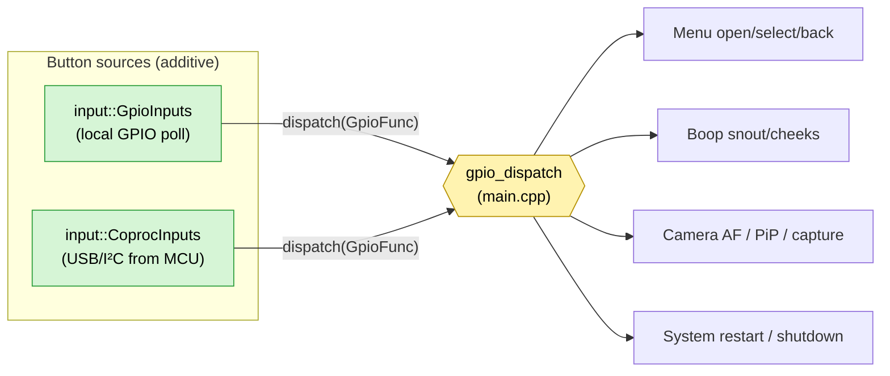

# Optional button/switch coprocessor — framework

A toggle that, when enabled, assumes a small MCU (**RP2350**, or an earlier
**RP2040/Pico**) sits between the physical switches and the Pi: it debounces the
buttons and streams press events over USB (or I²C), and the Pi dispatches them
through the **same input path** as on-board GPIO. When the toggle is **off**,
nothing changes — the existing `input::GpioInputs` GPIO poller runs as today.
The coprocessor is **never required**.

Why bother (ties into [`../hardware/carrier-board/MULTI-BACKEND.md`](../hardware/carrier-board/MULTI-BACKEND.md)):
- HUB75 eats most GPIO; only `{7,8,9,10,11,14,15,18,19,25}` stay free, and SPI
  contends for them. A coproc frees those pins for buses, not buttons.
- Precise debounce/long-press timing happens on the MCU, not a Linux poll loop.
- More switches than free GPIO; hot-pluggable; long switch harnesses terminate
  at the MCU (less EMI into the Pi).

## The one integration seam

The whole design hangs off a single fact: `GpioInputs` doesn't *do* anything
with a press — it calls a `std::function<void(GpioFunc)> dispatch` callback
(`src/input/gpio_inputs.h`). In `main.cpp` that callback is `gpio_dispatch`
(~line 11860), wired into the menu, boop, and camera actions. **A coprocessor
source just calls the same `dispatch`** — downstream code never knows the press
came from a different place.



`input::CoprocInputs` (skeleton in [`../src/input/coproc_inputs.h`](../src/input/coproc_inputs.h))
mirrors `GpioInputs`' lifecycle (`init()` / `shutdown()` / a status getter), so
`main.cpp` constructs and owns it the same way.

## Division of labor: dumb-meaning, smart-timing

Recommended split (keeps remapping in the HUD, offloads timing to the MCU):

| Job | Where |
|-----|-------|
| Debounce, edge detection, short vs long classification | **Coprocessor** (good at precise timing) |
| Button **id → GpioFunc** mapping (remappable in menu) | **Pi** (`CoprocConfig::short_map`/`long_map`, reusing `gpio_func_from_id`) |
| Acting on the function (menu/boop/camera) | **Pi** (existing `gpio_dispatch`) |

So the firmware reports *"button 3, long"* — not *"open menu"*. The Pi decides
what button 3 means, exactly like the GPIO map does today. Unmapped ids resolve
to `GpioFunc::None` (no-op).

## Wire protocol (v1, USB CDC — newline-delimited ASCII)

Deliberately trivial so it's debuggable with a serial terminal and easy to
implement on the MCU.

**Coprocessor → Pi**
```
HELLO proto-buttons v1 fw=1.1.0 n=8   # on connect: name, proto ver, fw ver, #buttons
BTN <id> DOWN                     # optional raw edges (ignored unless needed)
BTN <id> UP
BTN <id> SHORT                    # debounced, held < long_ms
BTN <id> LONG                     # debounced, held >= long_ms (fires once)
PING                              # heartbeat, ~1 Hz
I2C <hex> <hex> …                 # I2CSCAN reply: addresses that ACKed (or "none")
BOOP <electrode> <1|0>            # boop-pad touch edge (peripheral hub)
TEMP <rom16hex> <milli°C>         # one DS18B20 reading per probe per cycle
```

**Pi → Coprocessor** (optional, v1 can ignore)
```
PONG                              # ack heartbeat
CFG long_ms=600                   # push the long-press threshold
LED <id> <0|1>                    # drive a switch backlight, if wired
PINCFG CLR                        # begin a new pin map (see below)
PINCFG BTN <gp> <pull> <alow>     # append a button; its index = its id
PINCFG LED <id> <gp>              # backlight GPIO for a button
PINCFG APPLY                      # re-init pinModes + re-HELLO with the new count
SPI <cs> <hexbytes>               # MAX7219 relay: shift bytes out SPI1, pulse CS
I2CSCAN [sda] [scl]               # probe I2C (default GP20/21); replies "I2C …"
FAN <zone> <duty%>                # hold a fan PWM duty (peripheral hub)
```

### Peripheral hub (`-DPERIPHERAL_HUB`) — boop, temps, fans

The target architecture keeps the CM5's 40-pin header for the HUB75 bonnet and
the IMU only; every other GPIO peripheral hangs off the coprocessor. Building
the firmware with `-DPERIPHERAL_HUB` (on in the `rpipico2w_voice` env) adds:

- **Boop pads** — an MPR121 on the **shared I2C0 bus** (GP20/21, address 0x5A
  next to the voice DAC's 0x18 — zero extra pins). Touch edges stream up as
  `BOOP <electrode> <1|0>`; the Pi maps electrodes → zones with the SAME
  `boop.zones[].electrode` config a locally-wired MPR121 uses, so the pads work
  identically from either board (the derived both-cheeks zone stays local-only).
- **Temperature probes** — DS18B20s on a bit-banged 1-Wire bus (**GP19**, one
  4.7 kΩ pull-up to 3V3). Probes are auto-enumerated (ROM search, CRC-checked);
  each reports `TEMP <rom16hex> <milli°C>` every ~2 s. One probe is read per
  loop pass (≈7 ms) so button debounce never stalls.
- **Fans** — hardware-PWM zones on **GP14/GP15** (25 kHz). The temperature
  curve and all menu controls stay in the CM5's FanController; set
  `fans.output: "coproc"` and it sends resolved duties as `FAN <zone> <duty%>`
  (re-sent every 5 s so a rebooted coprocessor re-learns them). Optionally
  `fans.temp_probe: "<rom16hex>"` drives the curve from a coprocessor probe.

**I2C bus test:** `I2CSCAN` (optionally with SDA/SCL GP numbers) makes the
coprocessor probe 0x08–0x77 on that bus and reply `I2C <hex> …` (or `I2C none`).
An invalid pair — mixed controllers, or SDA/SCL roles swapped — is rejected with
`I2C err bad-pins` **before** the bus is touched, and a scan of I2C0 hands the
bus back to the voice DAC's pins afterwards.
Handy for confirming the TLV320 DAC (0x18) or any I²C device is wired right.
Trigger it from **GPIO → RP2350 GPIO Expander → I2C Bus Test → Scan Now**; the
result shows there. The controller follows the RP2350's fixed mux (GP `%4`), so
the pins pick I2C0 vs I2C1 automatically.

Parsing rules: one message per line; **ignore any malformed/unknown line**
(forward-compatible); a press is only the `SHORT`/`LONG` events (DOWN/UP are
advisory). If no line arrives within `heartbeat_timeout_ms`, mark **offline**.

### Runtime pin map (`PINCFG`) — change GPIO roles without a reflash

The firmware is "dumb about pins" the same way it's dumb about meaning: it boots
on the `config.h` defaults, and if the HUD config has an
`inputs.coprocessor.pins` array the Pi **pushes it on every connect** (right
after `HELLO`), so which GPIO is a button, its pull (`up|down|none`), its
polarity (`active_low`), and its backlight are all HUD config — **no firmware
rebuild to move a switch**. Reflash only for actual code changes (new effect,
new command, bug fix).

```jsonc
"inputs": { "coprocessor": {
  "pins": [
    { "gp": 2, "pull": "up", "active_low": true, "led_gp": -1 },   // id 0
    { "gp": 3, "pull": "up", "active_low": true, "led_gp": 25 }    // id 1 + backlight
  ]
}}
```

The array order is the button id, so it lines up with the `buttons` map above.
`pull`/`active_low` map to `INPUT_PULLUP` + active-low by default (a switch to
GND). The firmware re-`HELLO`s after `PINCFG APPLY`; the Pi pushes only once per
connection so that doesn't loop. Constraints: valid GP `0–29`, no pin used twice,
and — with the voice changer — keep the mic on GP26–28 and I2S BCLK/WS
consecutive (see [voice-changer.md](voice-changer.md)).

> Treat bytes from the link as **untrusted external input**: bound line length,
> validate `id` against `n`, never `eval`/format-inject. A flaky cable should
> degrade to "offline", never crash the reader thread.

## Driving MAX7219 panels through the coprocessor

piomatter's PIO ties up most of the CM5's GPIO while the HUB75 face is running,
so you can't cleanly get SPI on the CM5 for MAX7219 panels at the same time. The
coprocessor solves it by acting as a **USB→SPI bridge**: ProtoHUD's existing
`Max7219Chain` already formats the SPI bytes, and with **`transport: "coproc"`**
it ships them to the Pico as `SPI <cs> <hexbytes>`; the Pico (built with
`-DMAX_BRIDGE`) shifts them out **SPI1 (DIN=GP11, CLK=GP10)** and pulses
`kMaxCsPins[cs]` (default **GP13**). So the MAX panels run **alongside** HUB75
with zero CM5 GPIO.

Two roles, set in `protoface.max7219`:

- **`"mode": "main"`** + `backend: "max7219"` — the MAX chain *is* the face.
- **`"mode": "section"`** + `"enabled": true` — the MAX chain is an **extra
  surface** teed beside the HUB75 face (both driven from the same renderer).

Each chain is the usual `cols_chips × rows_chips` grid (or `module_positions`
for ragged layouts); just set `transport: "coproc"` + `coproc_cs`. Frames are
~1 bit/pixel and the chips self-refresh, so the load on the link and the Pico is
tiny. Power the panels from 5V, not the Pico's 3V3. See
`config/config.example.json` → `protoface.max7219`.

**Section content** (`protoface.max7219.content`): `face` mirrors the face-canvas
region the chain covers; `symbols` shows independent, triggerable content —
built-in symbols, short text, or patterns — driven by a standalone controller
over the coproc link. Trigger it three ways:

- **Buttons/menu:** the `max_next` / `max_prev` / `max_clear` GpioFuncs, or
  Face Display → MAX7219 Layout → **Content Library**.
- **Command FIFO** (parametric): `echo max_symbol:heart > /run/protohud/cmd`,
  `echo max_text:HELLO > …`, `echo max_pattern:bars > …`.

Built-in symbols: `heart star up down left right check cross smiley note excl
dot`; patterns: `solid border checker bars blank`; text uses a built-in 5×7 font.

## Updating the firmware from the CM5

Because the coprocessor is on USB, the CM5 can reflash it with **no BOOTSEL
button** — for real code changes (new effect, new command, a fix). Day-to-day
GPIO role changes don't need this at all; they go through `PINCFG` above.

One-time setup (installs PlatformIO + picotool + USB permissions):

```bash
scripts/install_coproc_tools.sh          # once; log out/in afterward
```

Then reflash — self-build on the CM5 so it always matches the repo source:

```bash
scripts/flash_coproc.sh --build          # build rpipico2w_voice, then flash
scripts/flash_coproc.sh --env rpipico2w --build   # plain (non-voice) build
scripts/flash_coproc.sh firmware.uf2     # or flash a prebuilt image
```

How it works: the script does the Arduino **1200-baud touch** on the coproc's
serial port, which reboots the RP2350 into its UF2 bootloader; then `picotool
load -x` writes the image and runs it. The firmware reports its version in the
`HELLO` line (`fw=…`), so you can confirm the update took after it reconnects.
ProtoHUD can stay running — the port drops during the reset and `CoprocInputs`
reconnects afterward. Bump `kFwVersion` in `config.h` whenever you change the
firmware.

## Transports

| | USB CDC (default) | I²C + IRQ |
|---|---|---|
| Wiring | one USB cable | SDA/SCL (shared bus 1) + 1 IRQ GPIO |
| Pros | hot-plug, trivial protocol, no Pi pins | no USB port used; clean on carrier |
| Cons | uses a USB port; `/dev/ttyACMn` races | Pi-master polling unless IRQ wired |
| Stable id | `/dev/serial/by-id/...` (match USB serial) | fixed 7-bit addr (e.g. 0x42) |

USB note: Teensy/SmartKnob/RAK4631 already enumerate as ACM0/1/2 — **match the
coproc by `by-id` path / USB serial string**, never a bare `ttyACMn` index.
I²C note: the coproc shares bus 1 with the IMUs/boop/light sensors; pick a free
address and (ideally) a data-ready IRQ on a spare GPIO so the Pi isn't polling.

## Proposed config (`inputs.coprocessor`)

```jsonc
"inputs": {
  "coprocessor": {
    "enabled": false,                 // master toggle — off = local GPIO only
    "transport": "usb_serial",        // "usb_serial" | "i2c"
    "device": "/dev/serial/by-id/usb-ProtoHUD_Buttons-if00",
    "baud": 115200,
    "i2c_addr": 66,                   // 0x42 (transport=="i2c")
    "irq_gpio": -1,
    "replace_local_gpio": false,      // false = additive; true = coproc only
    "heartbeat_timeout_ms": 2000,
    "buttons": [                      // id → function (reuses GpioFunc ids)
      { "id": 0, "short": "menu_select", "long": "menu_back" },
      { "id": 1, "short": "menu_open",   "long": "system_restart" },
      { "id": 2, "short": "boop_snout",  "long": "none" }
    ]
  }
}
```

A live **System → Button Coprocessor** toggle + status ("connected / offline,
N buttons") fits the existing GPIO Buttons menu, mirroring how other devices
surface `connected()`.

## Fallback behavior (never required)

- `enabled: false` → exactly today's behavior; `CoprocInputs` not constructed.
- `enabled: true`, **additive** (`replace_local_gpio: false`) → both sources
  feed `dispatch`; mix a few on-board buttons with the coproc.
- `enabled: true`, **replace** → only the coproc drives buttons; if it never
  connects or drops, log it and (optionally) re-enable the local GPIO poller so
  the user is never locked out of the menu.

## Implementation status — landed

1. ✅ **Reader** — `src/input/coproc_inputs.cpp` (in `CMakeLists.txt` SOURCES):
   USB-CDC open + termios raw config, reader thread with reconnect/backoff,
   length-bounded line parser → `handle_button(id, is_long)` → `short_map`/
   `long_map` → `dispatch_(func)`; heartbeat tracking drives `connected()`.
   (I²C transport is parsed but returns a clean "not implemented in v1".)
2. ✅ **Config** — `main.cpp` parses `inputs.coprocessor` into `CoprocConfig`
   (button list → `short_map`/`long_map` via `gpio_func_from_id`).
3. ✅ **Wiring** — `main.cpp` constructs `CoprocInputs(cfg, gpio_dispatch)` when
   enabled, sharing the dispatch with the GPIO poller; the local `GpioInputs`
   is gated on `!(coproc enabled && replace_local_gpio)`.
4. ✅ **Menu** — **System → GPIO Buttons → Button Coprocessor**: live Enabled
   toggle (applies via reload) + a Status readout (disabled/offline/connected).
5. ✅ **MCU sketch** — reference Arduino sketch + protocol at
   [`../firmware/button_coproc/README.md`](../firmware/button_coproc/README.md).

Example config lives in `config/config.example.json` under `inputs.coprocessor`.
