# Carrier Board — Block Diagram

System-level block diagram for the ProtoHUD carrier. It is a **two-brain**
board: the **CM5 drives only HUB75**, and the **RP2354B I/O coprocessor** owns
every other peripheral, linked to the CM5 over **USB-CDC**. Voltage domains and
the **3.3 V → 5 V level-shifting boundaries** are called out — each brain has its
own (see [`README.md`](README.md) and [`RP2354-IO.md`](RP2354-IO.md)).

Because HUB75 (CM5) and MAX7219 (RP2354B) are now on different brains, they can
run **simultaneously** — see [`MULTI-BACKEND.md`](MULTI-BACKEND.md).

High-speed I/O (USB 3.1 hub, USB 2.0 hub, PCIe switch) parts and layout notes
live in [`USB-PCIE-EXPANSION.md`](USB-PCIE-EXPANSION.md).

```mermaid
flowchart TB
    J1["J1 · 5 V INPUT<br/>fuse · reverse-polarity FET · TVS"]:::pwr

    subgraph RAILS["Power rails (common GND)"]
        direction LR
        R5C["5 V → CM5 (≥ 5 A)"]:::pwr
        R5F["5 V → HUB75 panels<br/>bulk caps"]:::pwr
        R5L["5 V → WS2812 (fused)"]:::pwr
        R5S["5–6 V → servos (fused)"]:::pwr
        R33["3.3 V (local LDO)<br/>RP2354B + sensors"]:::pwr
    end
    J1 --> R5C & R5F & R5L & R5S & R33
    R5C --> CM5
    R33 --> RP

    %% ===================== CM5 brain =====================
    CM5["Raspberry Pi CM5 — 2× DF40 100-pin<br/>GPIO = 3.3 V CMOS · drives ONLY HUB75"]:::cm5

    subgraph SHIFT1["3.3 V → 5 V (CM5 side)"]
        FBUF["U1/U2 · 74AHCT245 ×2 @ 5 V<br/>HUB75 face buffer"]:::shift
    end
    CM5 -- "HUB75 14× · 3.3 V" --> FBUF
    FBUF -- "5 V" --> HUB["J2 · HUB75 panels (2×8 IDC)<br/>R1 G1 B1 R2 G2 B2 A B C D E CLK STB OE"]:::load
    R5F --> HUB

    %% ===================== RP2354B brain =====================
    RP["RP2354B I/O coprocessor<br/>48 GPIO · 2 MB flash · PIO/PWM<br/>GPIO = 3.3 V CMOS"]:::rp
    CM5 == "USB 2.0 host" ==> HUBIC
    HUBIC == "USB-CDC" ==> RP

    subgraph SHIFT2["3.3 V → 5 V (RP2354B side)"]
        MBUF["U10 · 74AHCT245 @ 5 V<br/>MAX7219 DIN/CLK/CS"]:::shift
        LBUF["U11 · 74AHCT125 @ 5 V<br/>WS2812 ×4 data"]:::shift
    end
    RP -- "SPI0 · 3.3 V" --> MBUF
    RP -- "PIO ×4 · 3.3 V" --> LBUF
    MBUF -- "5 V" --> MAX["J3 · MAX7219 chain<br/>5 V · GND · DIN · CLK · CS×4"]:::load
    LBUF -- "5 V data" --> LED["J4 · WS2812 accessory LEDs"]:::load
    R5F --> MAX
    R5L --> LED

    %% ---- RP2354B 3.3 V-native ----
    subgraph DIRECT["RP2354B 3.3 V native — direct"]
        direction TB
        I2C["J5 · I²C0 (SDA GP4 / SCL GP5)<br/>4.7k pull-ups → BNO055 0x28 · MPU9250 0x68<br/>· MPR121 0x5A · BH1750 0x23"]:::dir
        BTN["J6 · buttons / boop (GP28–37)"]:::dir
        SRV["J20–J27 · 8 servos (GP20–27, PWM)<br/>3.3 V signal · 5–6 V power"]:::dir
    end
    RP --- I2C
    RP --- BTN
    RP --- SRV
    R5S --> SRV

    %% ---- RP2354B programming ----
    USEL{{"SW1 · USB selector"}}:::sel
    RP -. "DP/DM" .-> USEL
    USEL -. "A: hub→CM5" .-> HUBIC
    USEL -. "B: standalone" .-> UPROG["J12 · USB-C program port"]:::usb

    %% ---- CM5 cameras / display / USB / PCIe ----
    CM5 -- "2× CSI (MIPI)" --> CSI["J7/J8 · 2× cameras (22-pin FFC)"]:::dir
    CM5 -- "2× HDMI" --> HDMI["J10 · HDMI out / VITURE"]:::load

    subgraph USB["USB stack (two onboard hubs — see USB-PCIE-EXPANSION.md)"]
        direction TB
        HUB3["U20 · USB 3.1 Gen 1 hub ×4<br/>USB5744 → J11 ports"]:::usb
        HUBIC["J9 · USB 2.0 hub ×4<br/>USB2514B"]:::usb
        RP2350["RP2350 helmet audio<br/>(UAC2: 6-mic beamform/NR/DOA)"]:::usb
        KNOB["Smart knob"]:::usb
        LORA["LoRa RAK4631"]:::usb
        UCAM["USB cameras"]:::usb
        SS["spare 5 Gbps ports"]:::usb
        HUB3 --> UCAM & SS
        HUBIC --> RP2350 & KNOB & LORA
    end
    CM5 == "USB 3.0 #1 (5 Gbps)" ==> HUB3
    VIT["J14 · VITURE glasses USB data<br/>(1.5 A VBUS switch)"]:::usb
    CM5 == "USB 3.0 #2" ==> VIT

    subgraph PCIE["PCIe — one Gen 2 x1 lane, shared ~500 MB/s"]
        direction TB
        PSW["U21 · PCIe Gen 2 packet switch<br/>PI7C9X2G404 · 1 up + 3 down"]:::pcie
        NVME["J13 · M.2 Key-M · NVMe<br/>(recording / gallery)"]:::load
        PSP["2× spare x1<br/>(Coral TPU / 2.5GbE / …)"]:::load
        PSW --> NVME & PSP
    end
    CM5 == "PCIe Gen2 x1 · refclk · PERST#" ==> PSW

    classDef pcie  fill:#d2f2ec,stroke:#1d8a74,color:#000,font-weight:bold;
    classDef pwr   fill:#fde2c4,stroke:#c9772a,color:#000;
    classDef cm5   fill:#cfe3ff,stroke:#2a5bc9,color:#000,font-weight:bold;
    classDef rp    fill:#cfeaff,stroke:#1f8fc9,color:#000,font-weight:bold;
    classDef shift fill:#ffd6d6,stroke:#c92a2a,color:#000,font-weight:bold;
    classDef load  fill:#e8e8e8,stroke:#666,color:#000;
    classDef dir   fill:#d6f5d6,stroke:#2a9d3a,color:#000;
    classDef usb   fill:#ece0ff,stroke:#7a3ac9,color:#000;
    classDef sel   fill:#fff3b0,stroke:#b59000,color:#000;
```

## Legend

| Color | Meaning |
|-------|---------|
| 🟧 Orange | Power rail / protection |
| 🟦 Blue (bold) | CM5 compute module — drives HUB75 only |
| 🟦 Cyan (bold) | RP2354B I/O coprocessor — all other peripherals |
| 🟥 Red | **3.3 V → 5 V level shifter — required** |
| 🟨 Yellow | USB selector (hub ⇄ standalone program port) |
| ⬜ Grey | 5 V-logic load (panels, LEDs, HDMI) |
| 🟩 Green | 3.3 V-native peripheral — direct connect, no shifter |
| 🟪 Purple | USB hub / peripheral |
| 🟦 Teal (bold) | PCIe switch — fans out the CM5's single Gen 2 x1 lane |

## Connector schedule

| Ref | Connector | Brain | Signals | Domain |
|-----|-----------|-------|---------|--------|
| J1 | 5 V input | — | 5 V, GND (protected) | 5 V in |
| **J2** | **HUB75 face** (2×8 IDC) | CM5 | R1 G1 B1 R2 G2 B2 A B C D E CLK STB OE + GND | 5 V (buffered) |
| **J3** | **MAX7219 face** | RP2354B | 5 V, GND, **DIN, CLK, CS×4** | 5 V (buffered) |
| J4 | WS2812 LEDs (×4 zones) | RP2354B | 5 V, GND, DIN×4 (buffered) | 5 V |
| J5 | I²C0 sensors | RP2354B | SDA, SCL, 3.3 V, GND, INT | 3.3 V |
| J6 | buttons / boop | RP2354B | GPIO×n, 3.3 V, GND | 3.3 V |
| J7/J8 | CSI cameras | CM5 | 22-pin 0.5 mm FFC | MIPI |
| J9 | USB 2.0 hub (USB2514B) | CM5 | USB 2.0 host → RP2354B CDC / RP2350 audio / knob / LoRa | USB 2.0 |
| J10 | HDMI | CM5 | 2× HDMI out | — |
| J11 | USB 3.1 hub ports ×4 (USB5744) | CM5 | USB 3.0 #1 → USB cams + spare 5 Gbps ports | USB 3 (5 Gbps) |
| J12 | USB-C program port | RP2354B | standalone flash (via SW1) | USB |
| J13 | M.2 Key-M (NVMe) | CM5 | PCIe Gen2 x1 via PI7C9X2G404 switch (+2 spare x1) | PCIe |
| J14 | VITURE USB data | CM5 | USB 3.0 #2, 1.5 A VBUS switch | USB |
| J20–J27 | servo headers ×8 | RP2354B | SIG, +V_SERVO, GND | 5–6 V pwr / 3.3 V sig |
| SW1 | USB selector | RP2354B | routes RP2354B USB → hub **or** J12 | — |

> Servo headers are eight standard 3-pin connectors (24 positions); only the 8
> signals are unique — V+ and GND are the shared servo rail.

## MAX7219 backend notes (`src/face/max7219_chain.h`)

- Now driven by the **RP2354B**, not the CM5 — `MX_CLK`/`MX_DIN`/`MX_CS1..4`
  from GP2/GP3 + GP7–GP10, buffered to 5 V through **U10 (74AHCT245)** → J3.
- MAX7219 VCC = 5 V → input-high ≈ 3.5 V, so DIN/CLK/CS **must be buffered to
  5 V**. All are MCU → driver (unidirectional); DOUT daisies module→module, so
  no down-shift is needed.
- The CM5↔RP2354B contention that used to force "pick one face backend" is gone:
  HUB75 (CM5) and MAX7219 (RP2354B) are independent. The firmware still needs a
  composite output to light both at once — see [`MULTI-BACKEND.md`](MULTI-BACKEND.md).
