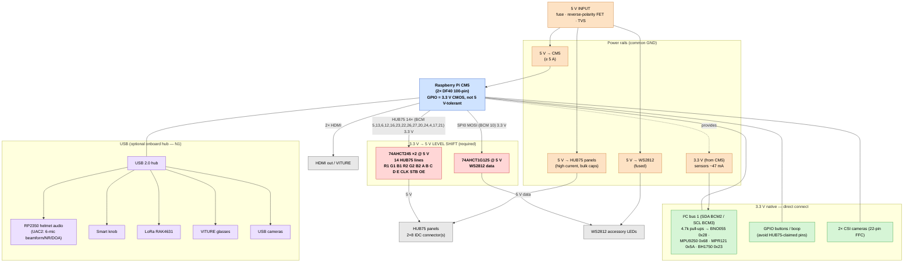

# Carrier Board — Block Diagram

System-level block diagram for the ProtoHUD CM5 carrier. Voltage domains and the
**3.3 V → 5 V level-shifting boundary** are called out explicitly — that
boundary is the whole reason the carrier exists (see [`README.md`](README.md)).

Pin references match the firmware (`src/main.cpp` `kHub75`, I²C bus 1, WS2812 on
SPI0 MOSI / BCM 10).

## Legend

| Color | Meaning |
|-------|---------|
| 🟧 Orange | Power rail / protection |
| 🟦 Blue | CM5 compute module (3.3 V GPIO source) |
| 🟥 Red | **3.3 V → 5 V level shifter — required** |
| ⬜ Grey | 5 V-logic load (panels, LEDs, HDMI) |
| 🟩 Green | 3.3 V-native peripheral — direct connect, no shifter |
| 🟪 Purple | USB peripheral (behind optional hub) |

The red blocks are the critical path: every signal crossing into a grey HUB75 /
WS2812 load goes through a 5 V buffer. Everything green wires straight to the
CM5 at 3.3 V.
