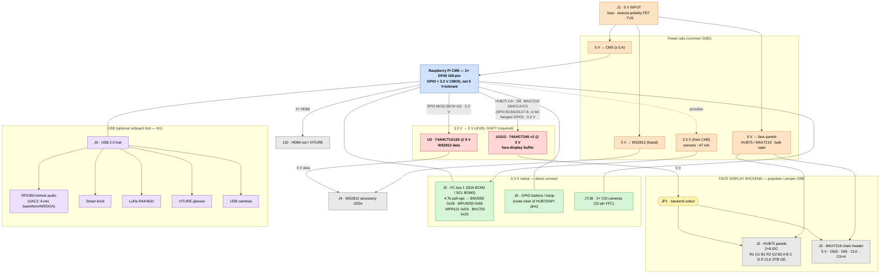

# Carrier Board — Block Diagram

System-level block diagram for the ProtoHUD CM5 carrier. Voltage domains and the
**3.3 V → 5 V level-shifting boundary** are called out explicitly — that
boundary is the whole reason the carrier exists (see [`README.md`](README.md)).

The **face display backend is "pick one"**: either **HUB75** panels *or* a
**MAX7219** 8×8-matrix chain (`src/face/max7219_chain.h`). Both are 5 V-logic
and share the same 3.3 V → 5 V buffer; a jumper selects which connector is
driven. Pin references match the firmware (`src/main.cpp` `kHub75`, MAX7219
SPI0 / GPIO transports, I²C bus 1, WS2812 on SPI0 MOSI / BCM 10).

## Legend

| Color | Meaning |
|-------|---------|
| 🟧 Orange | Power rail / protection |
| 🟦 Blue | CM5 compute module (3.3 V GPIO source) |
| 🟥 Red | **3.3 V → 5 V level shifter — required** |
| 🟨 Yellow | Jumper / backend select |
| ⬜ Grey | 5 V-logic load (panels, LEDs, HDMI) |
| 🟩 Green | 3.3 V-native peripheral — direct connect, no shifter |
| 🟪 Purple | USB peripheral (behind optional hub) |

## Connector schedule

| Ref | Connector | Signals | Domain |
|-----|-----------|---------|--------|
| J1 | 5 V input | 5 V, GND (protected) | 5 V in |
| **J2** | **HUB75 face** (2×8 IDC) | R1 G1 B1 R2 G2 B2 A B C D E CLK STB OE + 5 V/GND | 5 V (buffered) |
| **J3** | **MAX7219 face** | 5 V, GND, **DIN, CLK, CS×4** | 5 V (buffered) |
| J4 | WS2812 LEDs | 5 V, GND, DIN (buffered) | 5 V |
| J5 | I²C bus 1 | SDA, SCL, 3.3 V, GND | 3.3 V |
| J6 | GPIO buttons / boop | GPIO×n, 3.3 V, GND | 3.3 V |
| J7/J8 | CSI cameras | 22-pin 0.5 mm FFC | MIPI |
| J9 | USB (hub uplink) | USB 2.0 → RP2350 audio / knob / LoRa / VITURE / cams | USB |
| J10 | HDMI | 2× HDMI out | — |
| JP1 | Backend select | routes face buffer → J2 **or** J3 | — |

### MAX7219 backend notes (`src/face/max7219_chain.h`)

- **Transport A — hardware SPI0 (`spidev0.x`, default):** DIN = MOSI (BCM 10),
  CLK = SCLK (BCM 11), CS = CE0/CE1 (BCM 8 / BCM 7). Two hardware CS lines →
  up to two chains this way.
- **Transport B — bit-banged GPIO** (`Max7219GpioBus`): one shared DIN + CLK on
  any two GPIOs, plus one CS GPIO **per chain** (up to 4 broken out at J3).
  Used when SPI0 is taken by WS2812 / SPI1 by HUB75.
- MAX7219 VCC = 5 V → input-high ≈ 3.5 V, so DIN/CLK/CS **must be buffered to
  5 V** through the same `74AHCT245` (U1/U2). All three are CM5 → driver
  (unidirectional); the chain's DOUT daisies to the next module, not back to
  the CM5, so no down-shift is needed.
- ⚠️ **BCM 10 (MOSI) is shared** by WS2812 *and* MAX7219-over-SPI0 — they can't
  both use SPI0 at once. Use the MAX7219 GPIO transport (or move WS2812 to
  SPI1) if running both; JP1 + the firmware backend select keep it to one face
  path at a time.
