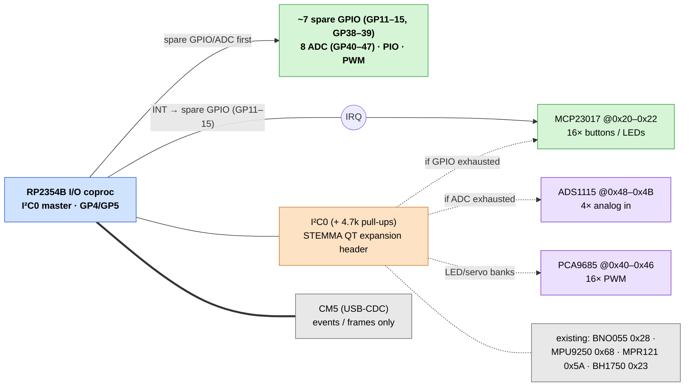

# I/O expansion — buttons, LEDs, analog, and keeping options open

Goal: plenty of **buttons**, **LED outputs**, and **analog inputs** now, with
headroom to add more later **without a board respin**.

Since the carrier pivoted to a **two-brain** design, the answer changed. The
**RP2354B I/O coprocessor is the primary I/O backbone** — 48 GPIO + PIO + PWM +
8 ADC, owning sensors, WS2812, buttons/boop, servos, and the MAX7219 backend
(see [`RP2354-IO.md`](RP2354-IO.md), [`PINMAP.md`](PINMAP.md)). So the **first**
answer to "I need more buttons / LEDs / analog" is **"use the RP2354B's spare
GPIO and ADC"** — no external part, no new bus. I²C expanders are now a
**secondary** route, used only if you exhaust the MCU's headroom or want a
solderless drop-in.

---

## 1. Primary backbone — the RP2354B itself

The coprocessor already has spare capacity baked into its pin map. Reach for
these **before** adding any chip:

| Resource | Pins | Headroom | Good for |
|----------|------|----------|----------|
| **Spare digital GPIO** | GP11–GP15, GP38–GP39 | **~7 lines** | extra buttons, LED indicators, expander INT/CS, 2nd UART/I²C |
| **Buttons block (already wired)** | GP28–GP37 | 10 lines populated, room to repurpose spares | more buttons/boop with MCU debounce |
| **ADC** | GP40–GP47 | **8 channels** (`AIN0..7`) | flex sensors, pots, batt sense — analog, native |
| **PWM** | any GPIO via the RP2350 PWM slices | servos use GP20–27; spares can PWM-dim LEDs | LED dimming, more servos |
| **PIO** | 2 blocks, 8 SMs | WS2812 on GP16–19 uses some | extra WS2812 chains, shift-register lanes, custom serial |

What this means in practice:

- **More buttons** → assign spare GPIO (GP11–GP15 / GP38–GP39), or grow the
  `BTN*` block. Debounce/long-press run on the MCU, not a poll loop.
- **More indicator LEDs** → drive a spare GPIO high through a series resistor
  (3.3 V swing), or **PWM-dim** one via a free PWM slice — no PCA9685 needed for
  a handful.
- **More addressable RGB** → spin up another **PIO WS2812** chain on a spare
  GPIO; the 4 existing zones (GP16–19) are just the populated ones.
- **Analog inputs** → use the **8 native ADC channels** (GP40–47). This is the
  big change: analog is now on-board and free, where before it needed an
  external ADS1115.

5 V-logic loads still level-shift on the **RP2354B side** (74AHCT245/125, per
[`RP2354-IO.md`](RP2354-IO.md#level-shifting-on-the-rp2354b-side)); 3.3 V buttons
and ADC inputs connect directly.

Only when you run out of the **~7 spare GPIO + 8 ADC** (or want a solderless
add-on) do you move to section 2.

---

## 2. Secondary — I²C expanders on the RP2354B's I²C0

If the MCU's own headroom isn't enough, hang an expander on the bus you've
**already routed on the RP2354B**: **I²C0, `SDA0 = GP4` / `SCL0 = GP5`** (4.7 k
pull-ups, `+3V3_RP`). The **RP2354B is the I²C master** — these chips do **not**
touch the CM5. The MCU firmware talks to them over I²C0 and surfaces the
results to the CM5 over **USB-CDC**, the same as every other peripheral.

| Part | Adds | Why reach for it |
|------|------|------------------|
| **MCP23017** | 16 bidirectional GPIO | many more buttons *and* LEDs on one chip; built-in pull-ups + INT-on-change; 3 addr pins → 8 chips = 128 lines |
| **ADS1115** | 4 analog inputs (16-bit) | only if you need **more than the 8 native ADC** channels, or higher resolution / differential |
| **PCA9685** | 16-ch 12-bit PWM | bright/dimmable LED banks or many more servos beyond the 8 native channels |

> The bus topology is already proven — the **MPR121 boop sensor is itself an
> I²C input expander** (12 capacitive channels) on this same I²C0.

### Interrupt wiring (so buttons aren't polled)
Tie an expander's **INTA/INTB** to a **spare RP2354B GPIO** — e.g. one of
**GP11–GP15** — so a press interrupts the MCU instead of being scanned. (Note
`GP6 = SENS_INT` is already the shared MPR121/IMU interrupt; pick a different
spare for the expander.) Bring out 2–3 INT lines if you fit multiple expanders.

### Address map (avoid collisions)

I²C0 already carries these sensors — plan expander addresses around them:

| Device | Addr | Notes |
|--------|------|-------|
| BH1750 light | `0x23` | ⚠️ don't put an MCP23017 here |
| BNO055 IMU | `0x28` | |
| MPR121 boop | `0x5A` | |
| MPU9250 IMU | `0x68` | |
| **MCP23017 ×N** | `0x20–0x22` | digital I/O — start low, skip `0x23` |
| **ADS1115** | `0x48–0x4B` | clear |
| **PCA9685** | `0x40–0x46` | avoid `0x5A`/`0x68` |

This matches the reservation in [`PINMAP.md`](PINMAP.md#contention-rules-much-simpler-now).

### LEDs: pick by need

| Need | Use |
|------|-----|
| A handful of **indicator LEDs** | spare **RP2354B GPIO** + resistor (no part) |
| A few **dimmable** LEDs | spare **RP2354B PWM** slice |
| **Addressable RGB** | the **WS2812 PIO** path (GP16–19, room for more) |
| **Many / bright / dimmable banks** | **PCA9685** (16-ch PWM) on I²C0 |
| **Lots of on/off LEDs + buttons together** | **MCP23017** on I²C0 |

MCP23017/PCA9685 outputs run at **3.3 V** (`+3V3_RP`); drive LEDs to GND through
a resistor. Per-chip current is limited (~25 mA/pin, ~125 mA/package for the
MCP23017) — for bright or many LEDs, PCA9685 is the cleaner answer and shares
the same I²C0 bus.

---

## 3. Keep options open — reserved address & connector space

So future parts plug in with **no layout change**:

1. **Reserve I²C address space** per the table above (already done in
   [`PINMAP.md`](PINMAP.md)).
2. Fit a **spare I²C expansion header / STEMMA QT (Qwiic, JST-SH 1 mm)** off
   **I²C0** on the carrier — solderless drop-in for an MCP23017, ADS1115, or
   PCA9685.
3. Break **2–3 INT lines** from spare RP2354B GPIO (GP11–GP15) to that header.
4. **A second serial-expansion lane** (e.g. `MCP23S17` or `74HC165/595` shift
   registers) would ride **spare RP2354B GPIO driven by PIO** — the MCU's SPI0
   is occupied by the MAX7219 backend, so use PIO + a couple of GP11–15/GP38–39
   lines rather than the SPI block. PIO has plenty of free state machines.

## Software path (RP2354B firmware)

Expander handling lives in the **RP2354B firmware** (`firmware/io_coproc/`,
RP2350 SDK / PlatformIO) — **not** on the CM5. The firmware:

1. Talks to any expander over its **I²C0** master (same driver pattern as the
   sensors it already polls), and watches the expander INT on a spare GPIO.
2. Maps expander pins to the **same button/LED/ADC abstractions** as the MCU's
   native pins, so a button on an MCP23017 behaves identically to one on a
   native `BTN*` GPIO.
3. Surfaces everything to the CM5 over **USB-CDC** using the existing line
   protocol (`BTN <id> SHORT|LONG`, ADC values, etc.) — see
   [`RP2354-IO.md`](RP2354-IO.md#cm5--rp2354b-link--usb-cdc) and
   [`../../docs/coprocessor-input.md`](../../docs/coprocessor-input.md).

Because events arrive over the **same USB-CDC path** as on-board buttons, the
CM5's `gpio_dispatch` / menu / boop code is unchanged — adding an expander is a
firmware change, not a Linux device-tree / `gpiochip` change. LED *outputs* are
likewise driven by MCU firmware (native GPIO/PWM, or the PCA9685/MCP23017 over
I²C0), commanded by the CM5 via CDC LED frames.

## See also
- [`RP2354-IO.md`](RP2354-IO.md) — the I/O coprocessor (primary backbone)
- [`PINMAP.md`](PINMAP.md) — pin/net/address source of truth
- [`REQUIREMENTS.md`](REQUIREMENTS.md) (N14–N16) · [`BOM.md`](BOM.md) (I/O expansion)
- [`../../docs/coprocessor-input.md`](../../docs/coprocessor-input.md) — USB-CDC coprocessor protocol
