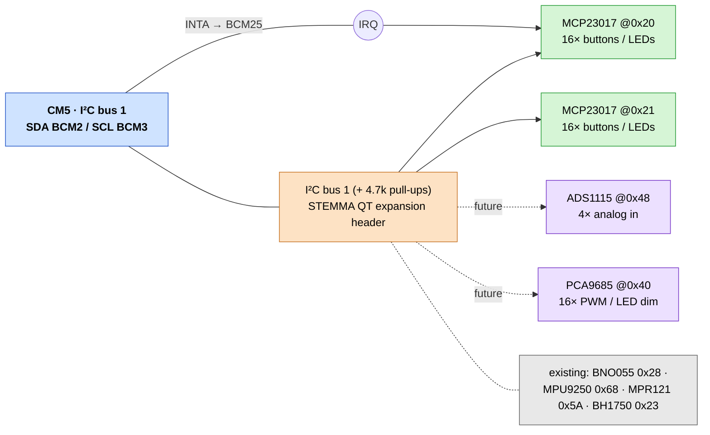

# I/O expansion — buttons, LEDs, and keeping options open

Goal: plenty of **buttons** and **LED outputs** now, with headroom to add analog
inputs or PWM later **without a board respin**. The strategy is one flexible
backbone part on a bus you've already routed, plus reserved address/connector
space for drop-ins.

## Backbone: MCP23017 (I²C, 16 bidirectional GPIO)

Why it fits "mostly buttons + LEDs, keep options open":

- Every one of its 16 pins is **independently input or output**, so the same
  part does buttons *and* LEDs — you decide per pin in software.
- Buttons: built-in **pull-ups** + **interrupt-on-change** (INTA/INTB).
- LEDs: each pin sinks/sources ~25 mA (≈125 mA total/package) — fine for
  indicator LEDs with series resistors.
- Sits on **I²C bus 1 you already wired** (SDA = BCM 2, SCL = BCM 3) → **zero
  new Pi GPIO**. 3 address pins → **8 chips = 128 lines** on one bus.
- Linux has a kernel driver (`mcp23017`/`gpio-mcp23s08`) that exposes it as a
  **`/dev/gpiochipN`** — see the software note below.

> You already run this pattern: the **MPR121 boop sensor is an I²C input
> expander** (12 capacitive channels), so the bus topology is proven.

### Interrupt wiring (so buttons aren't polled)
Tie the MCP23017 **INTA** to a spare Pi GPIO (**BCM 25** is free with HUB75
active) so a press wakes the Pi instead of being scanned. Bring 2–3 INT lines
out if you fit multiple expanders.

## Address map (avoid collisions)

Your bus already has these — plan expander addresses around them:

| Device | Addr | Notes |
|--------|------|-------|
| BH1750 light | `0x23` | ⚠️ don't put an MCP23017 here |
| BNO055 IMU | `0x28` | |
| MPR121 boop | `0x5A` | |
| MPU9250 IMU | `0x68` | |
| **MCP23017 ×N** | `0x20–0x22` | digital I/O — start low, skip `0x23` |
| **ADS1115** (future analog) | `0x48–0x4B` | clear |
| **PCA9685** (future PWM/LED dimming) | `0x40–0x46` | avoid `0x5A`/`0x68` |

## LEDs: pick by need

| Need | Use |
|------|-----|
| A handful of **indicator LEDs** | MCP23017 output pins + resistors |
| **Many / bright / dimmable** LEDs | **PCA9685** (16-ch PWM, I²C) |
| **Addressable RGB** | the existing **WS2812 accessory chain** (SPI0 MOSI) |

MCP23017 outputs swing to its VCC (run it at **3.3 V**); drive LEDs to GND
through a resistor. For anything needing brightness control or lots of current,
PCA9685 is the cleaner answer and shares the same I²C bus.

## "Keep options open" — the flexible bus plan

So future parts plug in with no layout change:

1. **Reserve I²C address space** per the table above.
2. Fit a **spare I²C expansion header / STEMMA QT (Qwiic, JST-SH 1 mm)** on the
   carrier — solderless drop-in for another MCP23017, an ADS1115, or a PCA9685.
3. Break **2–3 INT lines** to spare GPIO (`25`, and `18`/`19` are free since
   audio is on USB).
4. **SPI0 is also free** (BCM 7/8/9/10/11) — a second lane for **MCP23S17** or
   **74HC165/595** shift registers if I²C ever fills up.

## Software path (reuses what's already here)

Load the expander as a device-tree overlay → the kernel presents it as another
**`/dev/gpiochipN`**. ProtoHUD's button poller, `input::GpioInputs`, already
takes a **gpiochip path** argument — so expander pins can drive the *same*
button functions as on-board GPIO. Two small gaps to close:

1. `main.cpp` currently hardcodes `gpiochip0` → add an optional per-slot
   `"chip"` field in `gpio.pins` (and `inputs.coprocessor` is unaffected).
2. The menu pin-picker lists only the 40-pin header → let a slot target an
   expander chip/line.

LED *outputs* would be driven directly (libgpiod set-value on the expander
gpiochip, or the PCA9685 PWM path) — a thin output helper, not the input poller.

*This doc is the plan; say the word and I'll add the per-slot `chip` support so
expander buttons work with no new handling code, plus a minimal LED-output
helper.*

## See also
- [`REQUIREMENTS.md`](REQUIREMENTS.md) (N14–N16) · [`BOM.md`](BOM.md) (I/O expansion)
- [`MULTI-BACKEND.md`](MULTI-BACKEND.md) — the pin budget this works around
- [`../../docs/coprocessor-input.md`](../../docs/coprocessor-input.md) — the other expansion route (USB MCU)
