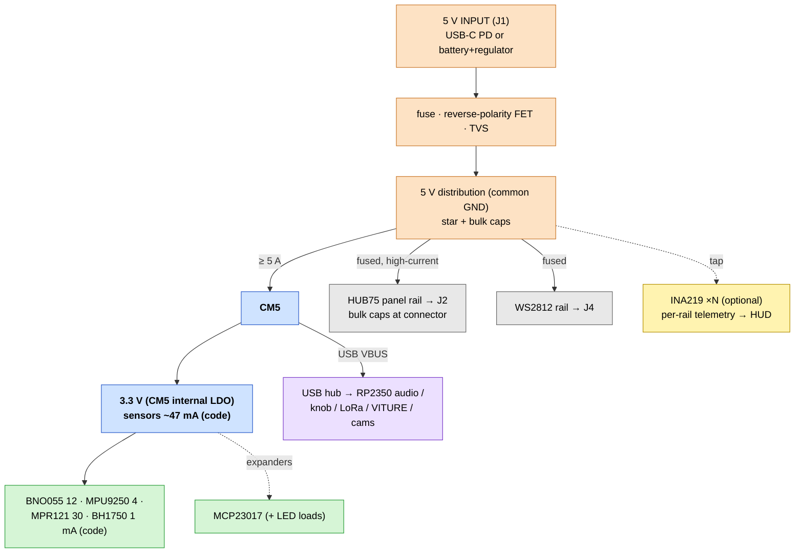

# Carrier Board — power tree & budget

How power flows and how big each rail must be. Per-device figures marked
**(code)** come from ProtoHUD's own estimator, `rail_currents_mA()` in
`src/main.cpp`; panel/LED draws are datasheet-typical. Everything shares one
ground.

## Domains

Three 5 V domains off one input, plus 3.3 V derived on the CM5:

| Rail | Feeds | Why separate |
|------|-------|--------------|
| **5 V · CM5** | CM5 + USB peripherals | clean, steady; must not brown out |
| **5 V · HUB75 panels** | J2 panel VCC | huge, spiky current — own copper + bulk caps |
| **5 V · WS2812** | J4 LED VCC | fused; LED inrush/noise off the CM5 rail |
| **3.3 V** (from CM5) | I²C sensors + expanders | low draw, CM5 supplies it |

## Budget — 3.3 V rail (from CM5)

| Load | Typical | Source |
|------|--------:|--------|
| BNO055 IMU | 12 mA | (code) |
| MPU9250 IMU | 4 mA | (code) |
| MPR121 boop | 30 mA | (code) |
| BH1750 light | 1 mA | (code) |
| MCP23017 expander(s) | ~1 mA each | datasheet |
| **3.3 V subtotal** | **~50 mA** | well within CM5's 3V3 |

> LEDs driven *by* an expander draw from **5 V**, not this rail — only the chip
> logic is on 3V3. Add a local 3.3 V buck only if the sensor set grows a lot.

## Budget — 5 V rails

### CM5 + USB
| Load | Typical | Peak | Notes |
|------|--------:|-----:|-------|
| CM5 (cameras, HDMI, render) | 3–4 A | ~5 A | RPi spec: 5 V/5 A PSU |
| USB stack (audio/knob/LoRa/VITURE/cams) | 0.5–1 A | ~1.5 A | per-port limited |
| **Subtotal** | **~4–5 A** | **~6.5 A** | |

### HUB75 panels (the big one)
Per 64×32 P2.5 panel @ 5 V:

| State | Per panel | 4-panel face (128×64) |
|-------|----------:|----------------------:|
| Typical animated face (~20–40% lit) | ~0.8–1.5 A | ~4–6 A |
| **Full white (worst case)** | ~3–4 A | **~12–16 A** |

> This rail dominates the design. Size copper/connectors/supply for the **full-
> white peak**, or cap brightness in software and budget the typical. A global
> brightness limit makes the difference between a 6 A and a 16 A supply.

### WS2812 accessory LEDs
`rail5 += LEDs × 20 mA` **(code)**, moderate brightness:

| Count | Typical (20 mA) | Full white (~60 mA) |
|------:|----------------:|--------------------:|
| 30 | 0.6 A | 1.8 A |
| 60 | 1.2 A | 3.6 A |

### MAX7219 (if used instead of HUB75)
`rail5 += modules × 80 mA` **(code)** at full brightness. An 8-module face ≈
0.64 A — trivial next to HUB75.

## Worked total (4-panel HUB75 + full sensors + 30 WS2812 + USB)

| Rail | Typical | Full-white peak |
|------|--------:|----------------:|
| CM5 + USB | ~4.5 A | ~6.5 A |
| HUB75 | ~5 A | ~16 A |
| WS2812 | ~0.6 A | ~1.8 A |
| 3.3 V (≈0.05 A → ~0.03 A@5V in) | — | — |
| **Total @ 5 V** | **~10 A (≈50 W)** | **~24 A (≈120 W)** |

**Recommendation:** size the 5 V supply for **≥ 10–12 A (50–60 W)** with a
software brightness cap, or **≥ 20 A** for uncapped full-white panels. Give
HUB75 its own high-current feed; don't push 16 A through the CM5 rail.

## Input options (it's a helmet — mind the current)

| Source | Reality |
|--------|---------|
| **USB-C PD** | 5 V/3 A (15 W) is *not enough* with panels. Use a **PD trigger to 9–20 V** + a buck to 5 V, or PD 5 V only for a brightness-capped build. |
| **Battery pack (recommended)** | 2S–3S Li-ion (7.4–11.1 V) + a **5 V buck rated for the peak** (≥ 10–20 A). Higher pack voltage = lower input current = thinner wiring. |
| **Single-cell power bank** | Can't sustain 16 A @ 5 V — only viable with a hard brightness cap / few panels. |

> A boost from 1S Li-ion to 5 V at >10 A is impractical; prefer a **buck from a
> higher-voltage pack**. Account for buck efficiency (~90%) in pack sizing.

## Protection & sequencing

- **Input:** fuse/polyfuse + reverse-polarity P-FET + TVS (REQ R2.1).
- **Per rail:** fuse the HUB75 and WS2812 rails (R2.3/R2.4); consider **e-fuses**
  (TPS259x, REQ N3) for latch-off short protection.
- **Bulk capacitance:** ≥ 1000 µF at the HUB75 connector, 470–1000 µF on CM5 and
  WS2812 rails — LED/panel rows switch hard.
- **Inrush:** big bulk + panels = inrush; consider soft-start / NTC on the panel
  rail so the supply doesn't fold on power-up.
- **Sequencing:** bring up CM5 5 V cleanly; panel/LED rails can come up with it
  (no strict ordering needed), but a brownout on the CM5 rail must not be caused
  by a panel surge — hence the separate feed.

## Telemetry (optional, ties into the HUD)

Per-rail **INA219/INA260** (REQ N2) lets ProtoHUD show *measured* draw next to
the existing `rail_currents_mA` *estimate*, and feeds the planned **battery
indicator** (CAPABILITIES → Possible Additions). I²C, so it rides bus 1.

## Conductor / connector sizing (quick guide)

| Current | Wire (chassis) | Notes |
|--------:|----------------|-------|
| ≤ 3 A | 22 AWG | sensors, single LED runs |
| ~5 A | 20 AWG | CM5 feed |
| ~10 A | 16 AWG | WS2812 + small panel count |
| ~16–20 A | 14–12 AWG | full HUB75 panel rail |

Use polarized/keyed power connectors (XT30/XT60 for the high-current input);
pour wide copper / multiple vias on the panel rail; keep the panel ground return
fat and short back to the star point.
