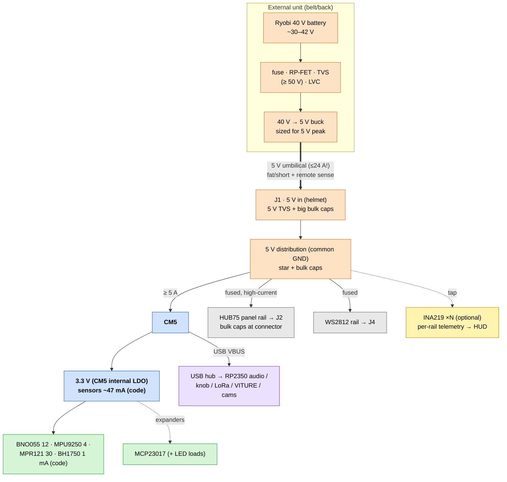

# Carrier Board — power tree & budget

How power flows and how big each rail must be. Per-device figures marked
**(code)** come from ProtoHUD's own estimator, `rail_currents_mA()` in
`src/main.cpp`; panel/LED draws are datasheet-typical. Everything shares one
ground.

## Domains

Three 5 V domains off one input, plus 3.3 V derived on the CM5:

| Rail | Feeds | Why separate |
|------|-------|--------------|
| **5 V · CM5** | CM5 + USB peripherals | clean, steady; must not brown out |
| **5 V · HUB75 panels** | J2 panel VCC | huge, spiky current — own copper + bulk caps |
| **5 V · WS2812** | J4 LED VCC | fused; LED inrush/noise off the CM5 rail |
| **3.3 V** (from CM5) | I²C sensors + expanders | low draw, CM5 supplies it |

## Budget — 3.3 V rail (from CM5)

| Load | Typical | Source |
|------|--------:|--------|
| BNO055 IMU | 12 mA | (code) |
| MPU9250 IMU | 4 mA | (code) |
| MPR121 boop | 30 mA | (code) |
| BH1750 light | 1 mA | (code) |
| MCP23017 expander(s) | ~1 mA each | datasheet |
| **3.3 V subtotal** | **~50 mA** | well within CM5's 3V3 |

> LEDs driven *by* an expander draw from **5 V**, not this rail — only the chip
> logic is on 3V3. Add a local 3.3 V buck only if the sensor set grows a lot.

## Budget — 5 V rails

### CM5 + USB
| Load | Typical | Peak | Notes |
|------|--------:|-----:|-------|
| CM5 (cameras, HDMI, render) | 3–4 A | ~5 A | RPi spec: 5 V/5 A PSU |
| USB stack (audio/knob/LoRa/VITURE/cams) | 0.5–1 A | ~1.5 A | per-port limited |
| **Subtotal** | **~4–5 A** | **~6.5 A** | |

### HUB75 panels (the big one)
Per 64×32 P2.5 panel @ 5 V:

| State | Per panel | 4-panel face (128×64) |
|-------|----------:|----------------------:|
| Typical animated face (~20–40% lit) | ~0.8–1.5 A | ~4–6 A |
| **Full white (worst case)** | ~3–4 A | **~12–16 A** |

> This rail dominates the design. Size copper/connectors/supply for the **full-
> white peak**, or cap brightness in software and budget the typical. A global
> brightness limit makes the difference between a 6 A and a 16 A supply.

### WS2812 accessory LEDs
`rail5 += LEDs × 20 mA` **(code)**, moderate brightness:

| Count | Typical (20 mA) | Full white (~60 mA) |
|------:|----------------:|--------------------:|
| 30 | 0.6 A | 1.8 A |
| 60 | 1.2 A | 3.6 A |

### MAX7219 (if used instead of HUB75)
`rail5 += modules × 80 mA` **(code)** at full brightness. An 8-module face ≈
0.64 A — trivial next to HUB75.

## Worked total (4-panel HUB75 + full sensors + 30 WS2812 + USB)

| Rail | Typical | Full-white peak |
|------|--------:|----------------:|
| CM5 + USB | ~4.5 A | ~6.5 A |
| HUB75 | ~5 A | ~16 A |
| WS2812 | ~0.6 A | ~1.8 A |
| 3.3 V (≈0.05 A → ~0.03 A@5V in) | — | — |
| **Total @ 5 V** | **~10 A (≈50 W)** | **~24 A (≈120 W)** |

**Recommendation:** size the 5 V supply for **≥ 10–12 A (50–60 W)** with a
software brightness cap, or **≥ 20 A** for uncapped full-white panels. Give
HUB75 its own high-current feed; don't push 16 A through the CM5 rail.

## Power delivery — external 40 V→5 V unit, 5 V to the helmet (selected)

Architecture: a **Ryobi 40 V pack + buck regulator live in an external unit**
(belt/back), and a **5 V umbilical feeds the helmet**. The carrier's J1 input is
therefore **5 V**, and all 40 V parts (dock, protection, buck) live off-helmet.

> ⚠️ **The catch — the umbilical now carries the full helmet current at 5 V.**
> Up to ~16–24 A (panels) flows through the cable, and 5 V has almost no margin
> (CM5 wants 4.75–5.25 V; panels dim/colour-shift below ~4.5 V). This *undoes*
> the low-current benefit of the 40 V battery, which only applied on the wire
> between the pack and the buck.

### Umbilical voltage drop (round-trip, copper)
Drop = I × R, with R = 2 × length × wire resistance. For a ~3 ft (0.9 m) run:

| 5 V load | 10 AWG (~6 mΩ) | 12 AWG (~9.5 mΩ) | 14 AWG (~15 mΩ) |
|---------:|---------------:|-----------------:|----------------:|
| 10 A (capped) | 0.06 V (1.2%) ✅ | 0.10 V (1.9%) ✅ | 0.15 V (3%) ⚠️ |
| 20 A | 0.12 V (2.4%) ⚠️ | 0.19 V (3.8%) ⚠️ | 0.30 V (6%) ❌ |
| 24 A (full white) | 0.14 V (2.9%) ⚠️ | 0.23 V (4.6%) ❌ | 0.36 V (7%) ❌ |

Plus I²R heat in the cable (e.g. 20 A through 12 AWG ≈ 3.8 W). Longer runs scale
linearly worse.

### Making the 5 V feed work
- **Fat + short umbilical** — 10–12 AWG silicone, as short as the build allows.
- **Brightness cap** in software keeps the panels near the ~10 A column (the
  green/✅ region) instead of full-white.
- **Remote sense** — if the external buck supports 4-wire sense, run sense leads
  to the carrier so it regulates 5 V *at the helmet*, cancelling cable drop.
- **Large bulk capacitance at J1** to ride out spikes the cable can't deliver.
- Consider **separate feeds** for the panel rail vs CM5 so a panel surge doesn't
  drag the CM5 input down.

### Strongly consider instead: distribute 40 V, step down *in* the helmet
Putting the buck **on/near the carrier** and running **40 V down the umbilical**
drops the cable current to **~3 A** — so a thin, light cable with negligible
drop, and no high-current 5 V umbilical at all. Same battery, same buck, just
relocated. This is the lower-loss, lighter-cable option; the only reasons to keep
the buck external are to keep 40 V off the helmet (safety/regs) or to move the
converter's bulk/heat off your head. **If you can, step down at the helmet.**

### Regulator (in the external unit either way)

The **40 V → 5 V buck** specs are unchanged — high pack voltage means low input
current; the heavy amps live on the 5 V output (which is now the umbilical).

### Regulator selection (the critical part)
- **Wide input range:** must accept ~30–42 V; spec the converter for **≥ 50 V
  input** for margin (transients, full charge).
- **Output power = your 5 V peak:** a 42 V → 5 V buck must supply the full board
  draw. From the budget that's **~50 W typical (cap brightness)** or up to
  **~120 W full-white** (24 A @ 5 V). Size the converter accordingly:
  - Brightness-capped build → a **5 V / 10–15 A (50–75 W)** buck.
  - Uncapped full-white panels → a **5 V / 25–30 A (120–150 W)** buck.
- **Input current is small:** 120 W ÷ 40 V ÷ ~0.9 eff ≈ **~3.3 A** on the
  battery side → input wiring can be **16–18 AWG**; the **5 V output** is where
  the 20 A lives, so put the regulator **close to the panels** and keep the 5 V
  run fat and short.
- **Thermal:** at ~90 % efficiency a 120 W converter dumps **~12 W** as heat —
  heatsink it and give it airflow.

### Battery interface & safety
- **Dock/adapter:** mount via a Ryobi 40 V tool-side dock (3D-printable mounts +
  contacts, or an aftermarket adapter). Connect **B+ / B−**; the large center
  contacts carry current.
- **Low-voltage cutoff:** the pack's internal BMS protects the cells, but
  behavior varies — add a **low-voltage cutoff / battery monitor** (~3.0 V/cell,
  ~30 V pack) so the HUD shuts down gracefully rather than relying on the pack
  folding under load. Surface pack voltage via INA219 / an ADC divider.
- **Fuse the battery feed** right at the dock for the pack's fault current.

### Runtime (≈ pack Wh ÷ load)
| Pack | Energy | Typical (~50 W) | Full-white (~120 W) |
|------|-------:|----------------:|--------------------:|
| 4.0 Ah | ~144 Wh | ~2.5–3 h | ~1.1 h |
| 6.0 Ah | ~216 Wh | ~4 h | ~1.7 h |

> Energy ≈ Ah × ~36 V nominal; usable is a bit less after the buck (~90 %) and
> the low-voltage cutoff.

### Why this beats the alternatives here
| Source | vs. the 40 V plan |
|--------|-------------------|
| USB-C PD 5 V/3 A | far too little (15 W) for panels |
| 1S Li-ion + boost | impractical to boost to 5 V at >10 A |
| **Ryobi 40 V + buck** | ✅ low input current, high capacity, hot-swappable packs |

## Umbilical (backpack ↔ helmet)

System partition: the **backpack** holds the Ryobi battery, the 40 V→5 V
regulator, and the **phone dock**; a tether runs to the **helmet** carrying two
things:

| Conductor | Carries | Notes |
|-----------|---------|-------|
| **5 V power** | up to ~24 A @ 5 V (see drop table above) | fat 10–12 AWG + GND; add a **remote-sense pair** to J1 |
| **USB 2.0** | phone (in dock) ↔ CM5 host | scrcpy/ADB mirror + KDE Connect over USB; one CM5 port |

The phone connects as a **USB device** to the CM5's USB **host** port — ProtoHUD
runs `scrcpy` over ADB to mirror it into a V4L2 node (`src/android/android_mirror.cpp`).
So the helmet end of the USB lands on a CM5 USB port (dedicate one to the
umbilical — see `J11` in [`CONNECTORS.md`](CONNECTORS.md)); the in-helmet USB hub
(RP2350 audio / knob / LoRa / VITURE / cams) stays on a separate port.

### Build notes
- **Keep USB away from the power conductors.** Use the cable's shielded,
  twisted D+/D− pair; route it apart from the high-current 5 V leads to avoid
  the panel/LED switching noise coupling into USB. USB 2.0 is fine to ~5 m, so
  cable length isn't the worry — noise is.
- **Phone charging / VBUS — decide one:**
  - *Passive dock (simplest):* the single USB cable carries CM5 VBUS up to the
    phone; the CM5 charges it slowly (limited port current, and it adds to the
    5 V umbilical load).
  - *Charge-injection dock (faster):* the dock charges the phone from the
    backpack 5 V, data-only to the CM5 — **must isolate VBUS** so the dock
    doesn't back-feed the CM5 port.
- **One connector or two:** a single multi-pin circular (e.g. GX16/GX20 or a
  rugged push-pull) can carry both power and USB, or keep them as two separate
  keyed connectors. If combined, segregate the USB pair from the power pins.

## Protection & sequencing

Split across the two units:

- **External unit (40 V):** rate input protection for **≥ 50 V** — fuse,
  reverse-polarity P-FET (VDS ≥ 60 V), TVS (~45 V standoff), buck input cap
  ≥ 50 V. This is where the battery-voltage parts live.
- **Carrier / helmet (5 V at J1):** 5 V-class reverse-polarity FET + TVS
  (SMBJ5.0A) + **large bulk capacitance** at the input to absorb umbilical drop
  and spikes (REQ R2.1). If using remote sense, bring the sense pair to J1.
- **Per rail:** fuse the HUB75 and WS2812 rails (R2.3/R2.4); consider **e-fuses**
  (TPS259x, REQ N3) for latch-off short protection.
- **Bulk capacitance:** ≥ 1000 µF at the HUB75 connector, 470–1000 µF on CM5 and
  WS2812 rails — LED/panel rows switch hard.
- **Inrush:** big bulk + panels = inrush; consider soft-start / NTC on the panel
  rail so the supply doesn't fold on power-up.
- **Sequencing:** bring up CM5 5 V cleanly; panel/LED rails can come up with it
  (no strict ordering needed), but a brownout on the CM5 rail must not be caused
  by a panel surge — hence the separate feed.

## Telemetry (optional, ties into the HUD)

Per-rail **INA219/INA260** (REQ N2) lets ProtoHUD show *measured* draw next to
the existing `rail_currents_mA` *estimate*, and feeds the planned **battery
indicator** (CAPABILITIES → Possible Additions). I²C, so it rides bus 1.

## Conductor / connector sizing (quick guide)

| Current | Wire (chassis) | Notes |
|--------:|----------------|-------|
| ≤ 3 A | 22 AWG | sensors, single LED runs |
| ~5 A | 20 AWG | CM5 feed |
| ~10 A | 16 AWG | WS2812 + small panel count |
| ~16–20 A | 14–12 AWG | full HUB75 panel rail |

Use polarized/keyed power connectors (XT30/XT60 for the high-current input);
pour wide copper / multiple vias on the panel rail; keep the panel ground return
fat and short back to the star point.
